# Procesverslag
Markdown is een simpele manier om HTML te schrijven.  
Markdown cheat cheet: [Hulp bij het schrijven van Markdown](https://github.com/adam-p/markdown-here/wiki/Markdown-Cheatsheet).

Nb. De standaardstructuur en de spartaanse opmaak van de README.md zijn helemaal prima. Het gaat om de inhoud van je procesverslag. Besteedt de tijd voor pracht en praal aan je website.

Nb. Door *open* toe te voegen aan een *details* element kun je deze standaard open zetten. Fijn om dat steeds voor de relevante stuk(ken) te doen.

## Jij

  
uitwerken voor kick-off werkgroep

  ### Auteur:
  Nikki Rosenboom

  #### Je startniveau:
  Wit/starter

  #### Je focus:
  Mijn focus ligt op de surface plane
 

## Je website

  
uitwerken voor kick-off werkgroep

  ### Je opdracht:
  https://bolt.eu/nl-nl/

  #### Screenshot(s) van de eerste pagina (small screen): 
  hier de naam van de pagina  
  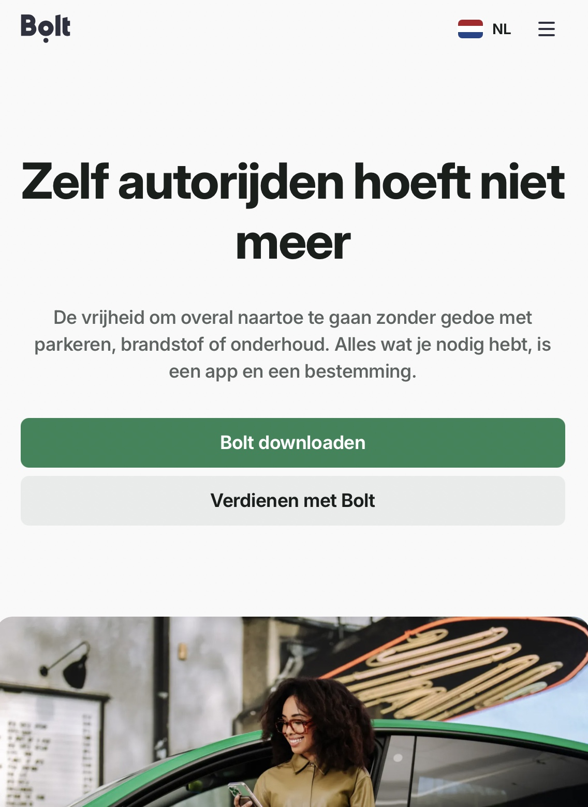

  #### Screenshot(s) van de tweede pagina (small screen):
  hier de naam van de pagina  
  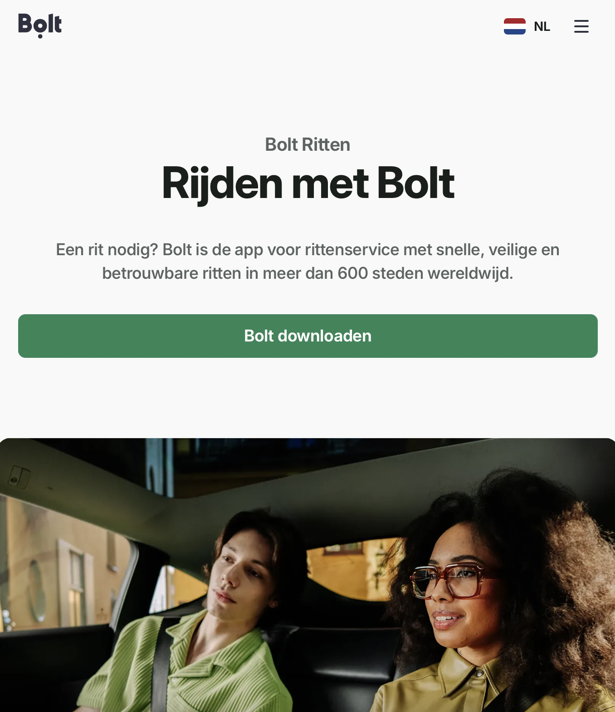
  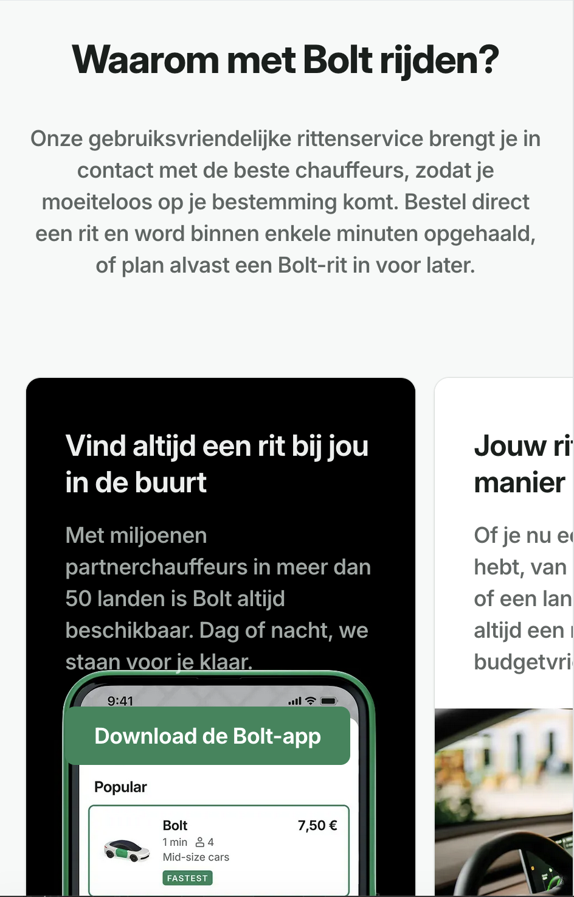
  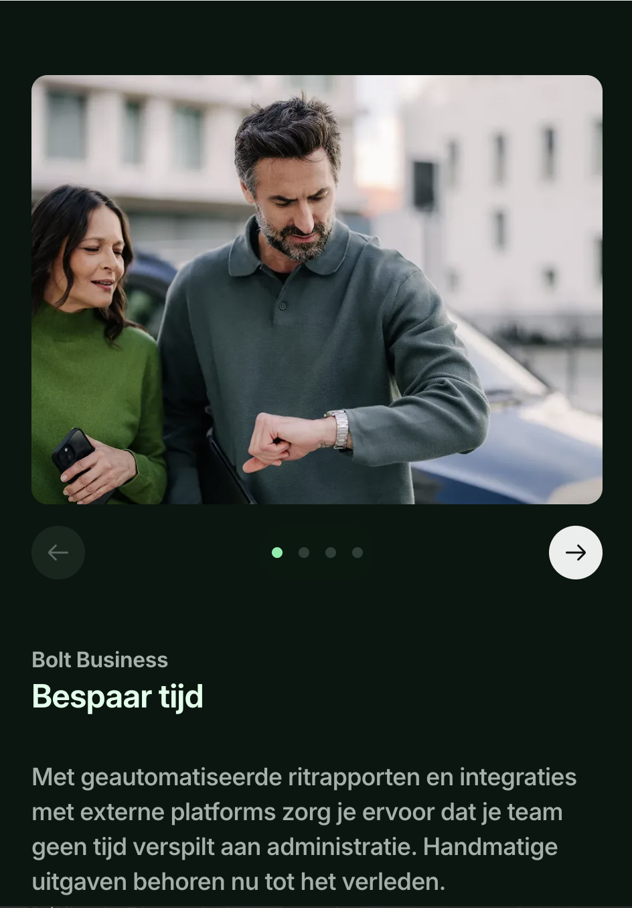
  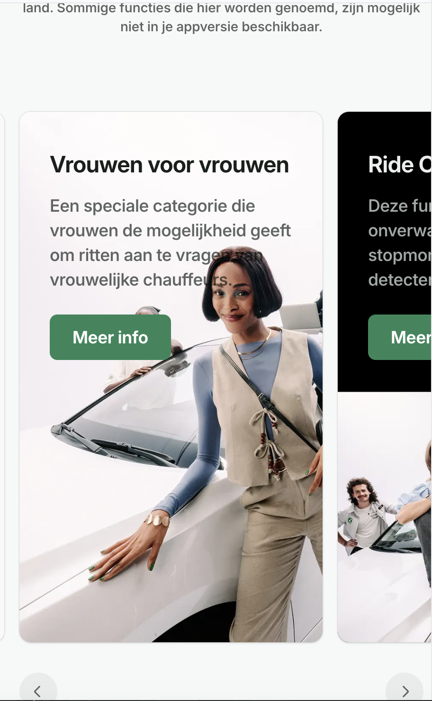
 

## Toegankelijkheidstest 1/2 (week 1)

  
uitwerken na test in 2e werkgroep

   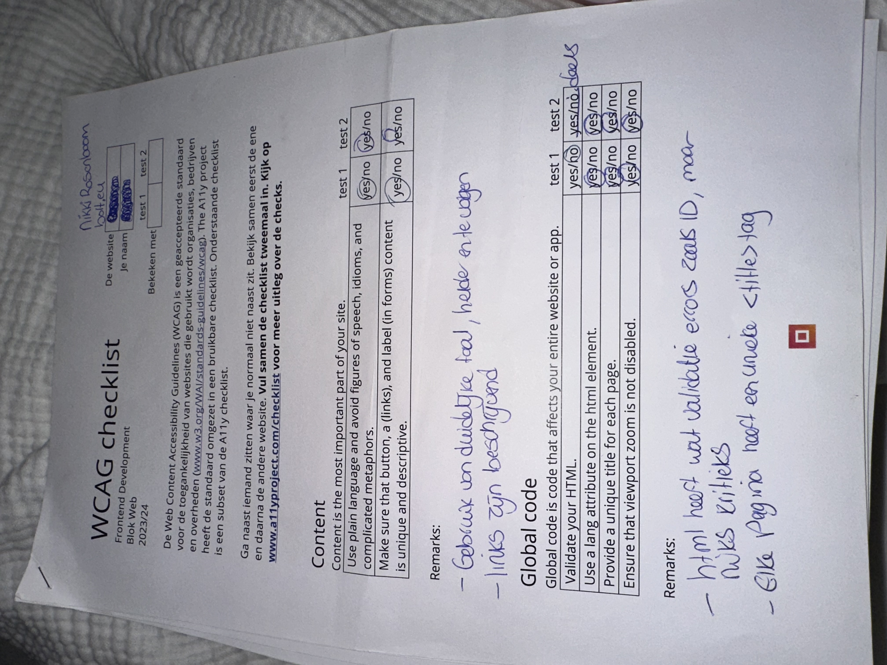
   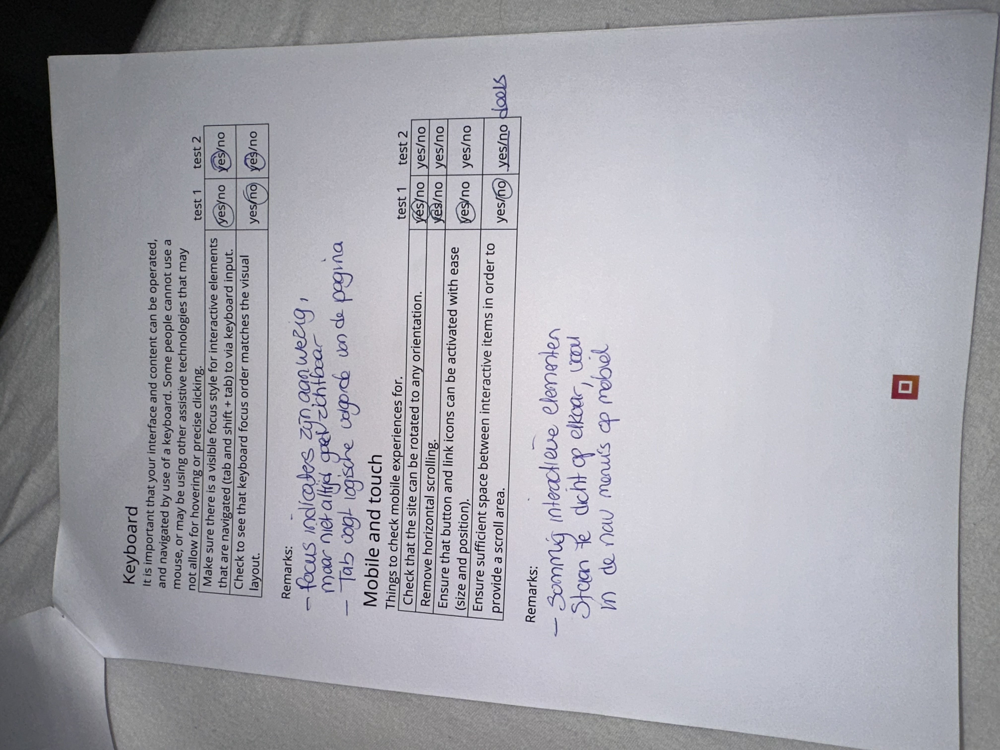
   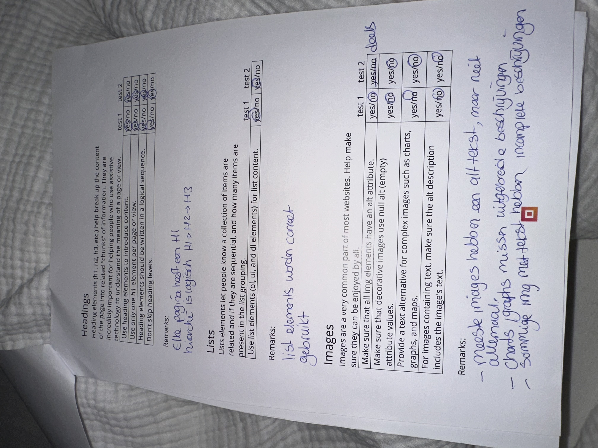
   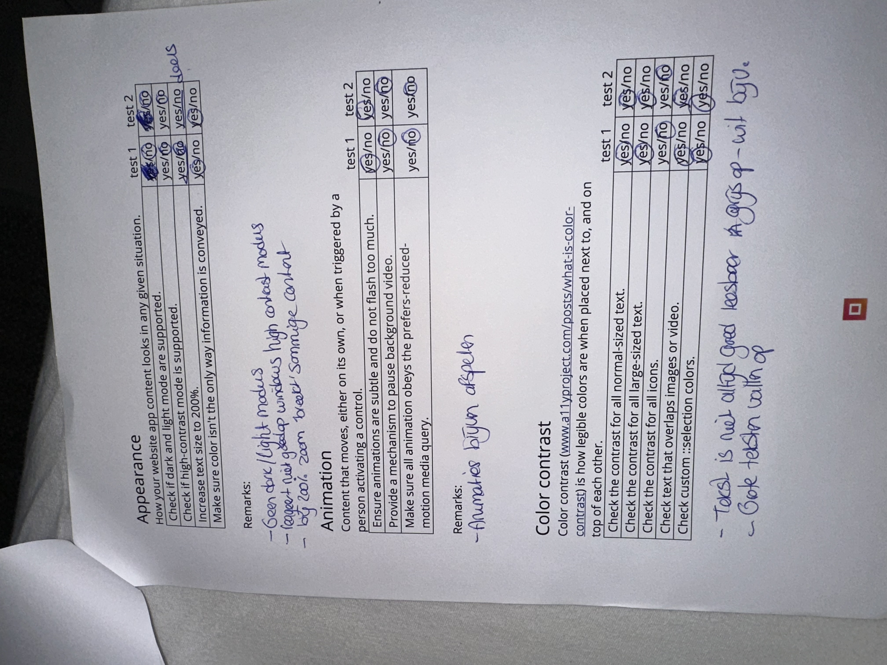
   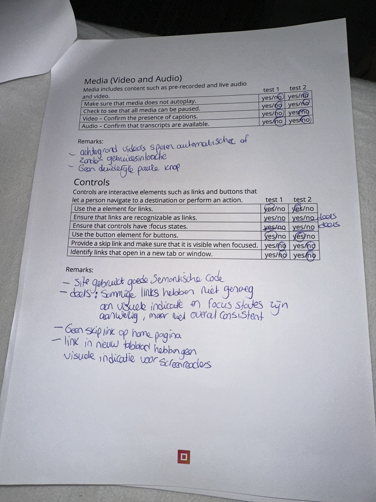

  ### Bevindingen
  Serke punten
  Semantische HTML wordt correct gebruikt voor links en buttons

  Site is responsive en werkt op verschillende apparaten

  Goede heading structuur

  Unieke pagina titels

  Content is helder en duidelijk

  Keyboard focus order is logisch

  Verbeterpunten
  Autoplay video's zonder controles

  Geen captions voor media

  Geen skip link voor keyboard navigatie

  Problemen bij 200% zoom

  Geen dark modus

  IMG alt tekst is niet compleet en decoratieve IMG hebben incorrecte alt tekst

  HTML heeft validatie errors

  Dit zijn mijn bevindingen

## Breakdownschets (week 1)

  
uitwerken na afloop 3e werkgroep

  ### de hele pagina: 
  

  ### dynamisch deel (bijv menu): 
  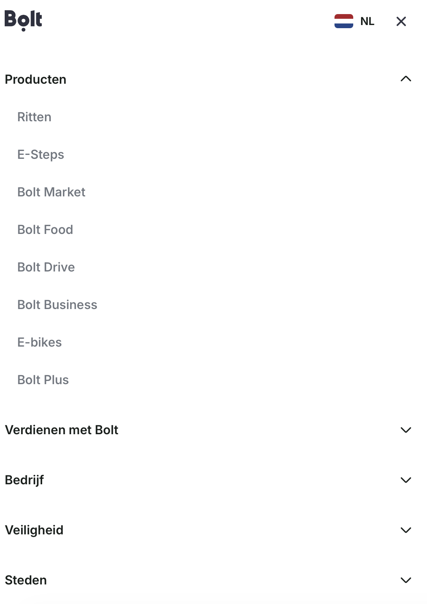

  ### wellicht nog een dynamisch deel (bijv filter): 
  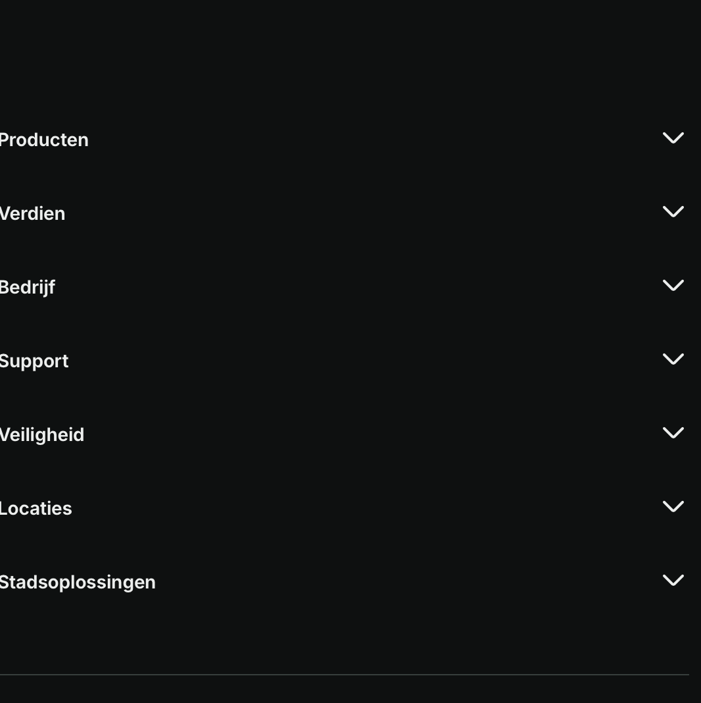

## Voortgang 1 (week 2)

  
uitwerken voor 1e voortgang

  ### Stand van zaken
  Ik heb uiteindelijk gekozen voor de Bolt website. 
  Ik heb getest met een screenreader en dit zijn mijn uitkomsten:

  het hamburgermenu opent na indrukken van 'control' 'option' en 'spatie'.
  Dan leest de screenreader: webvenster met 3 onderdelen.

  Wat er ontbreekt is de context voor degene die de screenreader gebruikt.
  Wanneer je op 'tab' klikt dan slaat hij de onderdelen over. Dus het onderdeel
  'winkel' pakt hij niet. Deze heeft ook verder geen uitleg, waardoor het voor
  de gebruiker die de screenreader gebruikt niet duidelijk is was de functie
  van deze link is. 

  Ook geeft de voice-over aan dat je op 'control' 'option' en 'spatie' moet
  klikken, om een link in te gaan. Echter lukt dit niet altijd en blijf je 
  op dezelfde pagina hangen.

## Voortgang 2 (week 3)

  
uitwerken voor 2e voortgang

  ### Stand van zaken
  Door een persoonlijke reden is het moeilijk gelukt om voorruitgang te boeken. 
  Ik prober nth-child te begrijpen en leer dit toe te passen in plaats van classes. Normaal gebruik ik
  altijd classes dus deze manier van werken is erg wennen. Ook probeer ik zo min mogelijk
  divs toe te voegen. Als ik een div gebruik is dit voor css doeleinden. 

  Ik ben op dit moment bezig met pagina 1. Ik heb alle html al wel af voor beiden pagina's.
  

  ### Verslag van meeting
  hier na afloop snel de uitkomsten van de meeting vastleggen

  Ik moet hard aan de slag wil ik dit vak halen. Zo moet ik werken aan
  - css toevoegen voor pagina 2
  - starten met de surface plane
  - javascript starten

## Toegankelijkheidstest 2/2 (week 4)

  
uitwerken na test in 9e werkgroep

  ### Bevindingen

  Nogmaals mijn bevindingen

  Serke punten/
  Semantische HTML wordt correct gebruikt voor links en buttons

  Site is responsive en werkt op verschillende apparaten

  Goede heading structuur

  Unieke pagina titels

  Content is helder en duidelijk

  Keyboard focus order is logisch

  Verbeterpunten/
  Autoplay video's zonder controles

  Geen captions voor media

  Geen skip link voor keyboard navigatie

  Problemen bij 200% zoom

  Geen dark modus

  IMG alt tekst is niet compleet en decoratieve IMG hebben incorrecte alt tekst

  HTML heeft validatie errors

  Dit zijn mijn bevindingen

## Voortgang 3 (week 4)

  
uitwerken voor 3e voortgang

  ### Stand van zaken
  Pagina 1 is met css en html zo goed als af. Ik heb moeite met de css op mijn tweede pagina,
  omdat er veel aagepast word door gebruik van nth-child. Ik moet regelmatig !important gebruiken om dit te overschrijden en classes pakt hij soms ook niet. Al met al verloopt
  de opdracht erg moeizaam.

  ### Verslag van meeting
  Ik krijg als feedback om terug naar de codepen opdrachten te kijken zoals voor
  het hamburger menu en carousel. Verder wordt verteld dat ik wel classes mag gebruiken
  indien dit nodig is. Ik ga het waarschijnlijk niet op tijd af hebben.

## Eindgesprek (week 5)

  
uitwerken voor eindgesprek

  ### Je uitkomst - karakteristiek screenshots:
  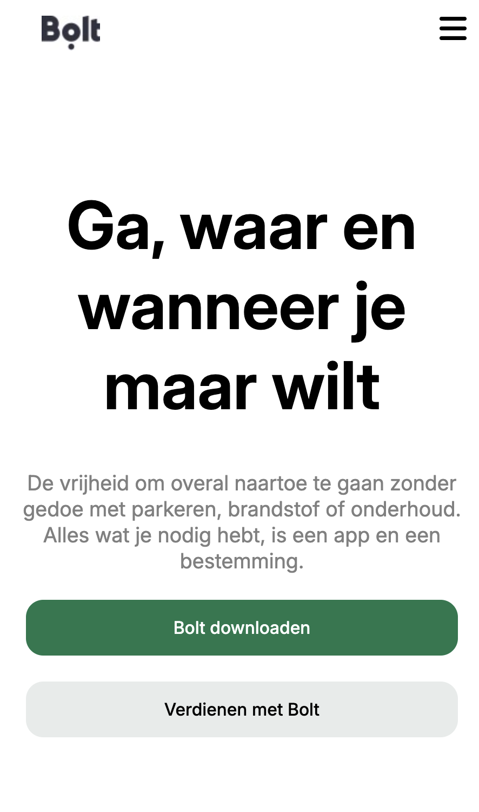
  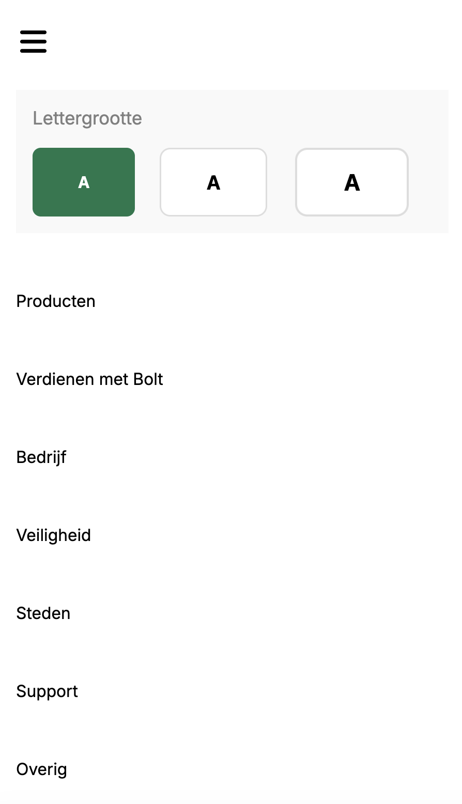
  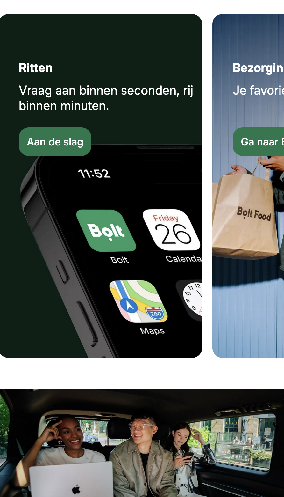
  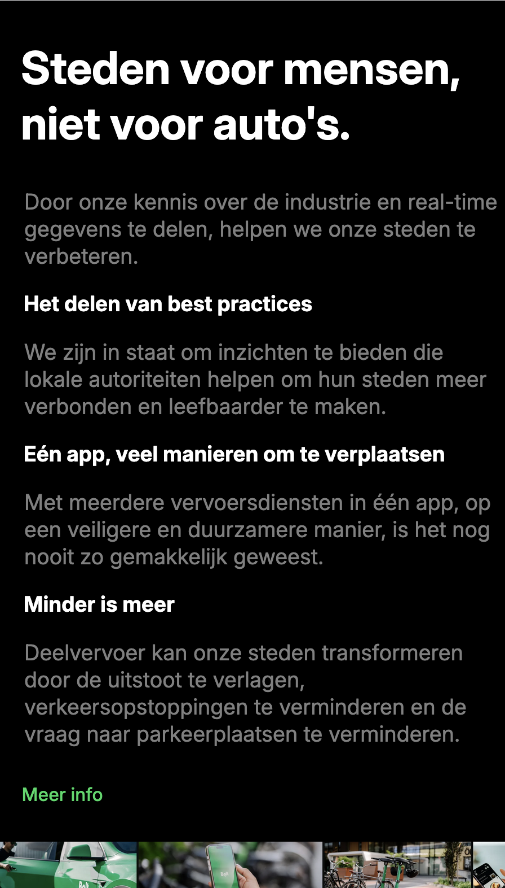
  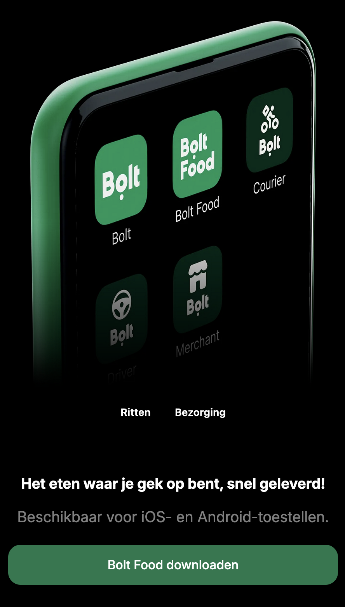
  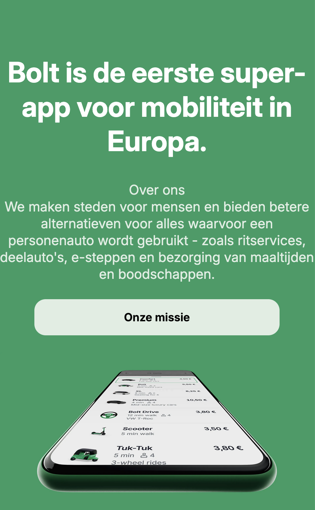
  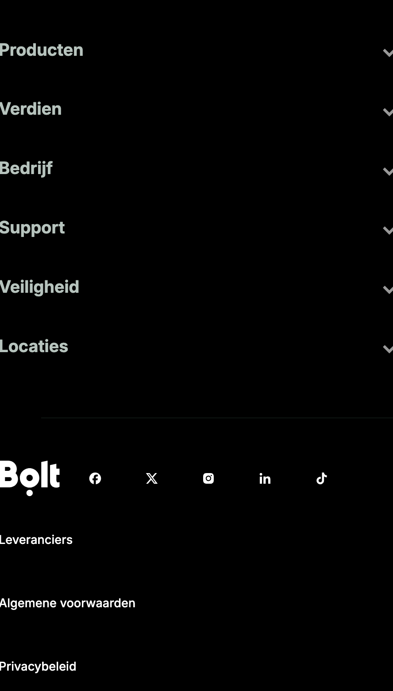
  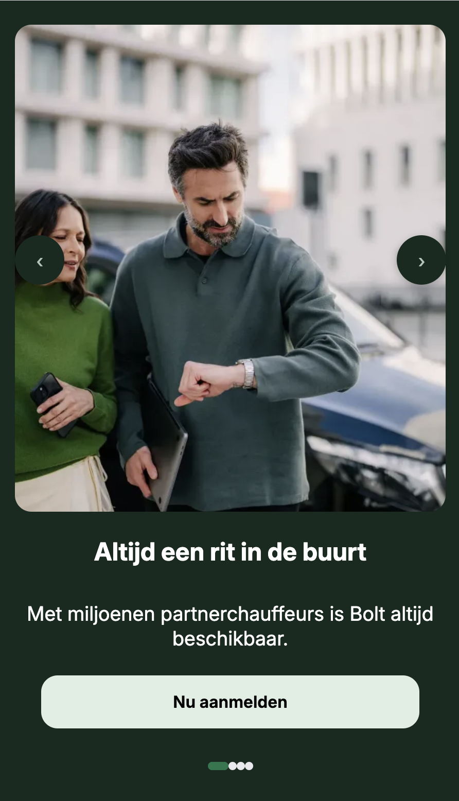
  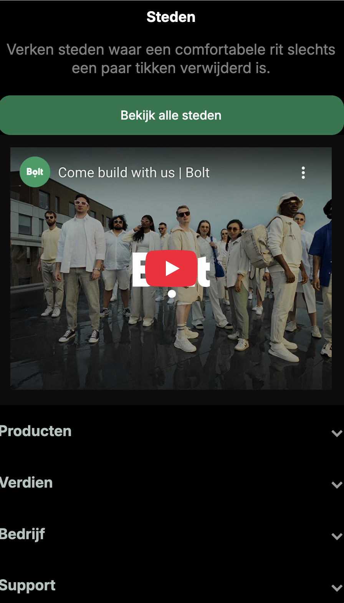

  ### Dit ging goed/Heb ik geleerd: 
  Korte omschrijving met plaatjes

 
 Ik heb geleerd hoe ik een micro-interactie zoals een hamburgermenu met javascript maak.
 Ook via html en javascript. Dit is de eerste keer dat ik dit gemaakt heb.

 Ook zie je verschillende groottes in lettertype in het hamburgermenu. Ook dit was nieuw
 en ik heb geleerd via internet/ mede-studenten hoe ik dit kan toepassen.

 
 Ik heb een slider gemaakt door te kijken naar mijn eerdere gemaakte opdrachten van vorig jaar
 en hulp te kijken naar de codepen carousel opdracht.

 
 Ik heb vorig jaar een video toegevoegd tot mijn website dus dat was gelukkig niet zo moeilijk.
 De footer ontwerpen met behulp van een details list en een summary was nieuw voor mij. Hiervoor
 heb ik online naar informatie gezocht en dit mijzelf aangeleerd. Ik ben tevreden over het
 eindresultaat.

  ### Dit was lastig/Is niet gelukt:
  Korte omschrijving met plaatjes

  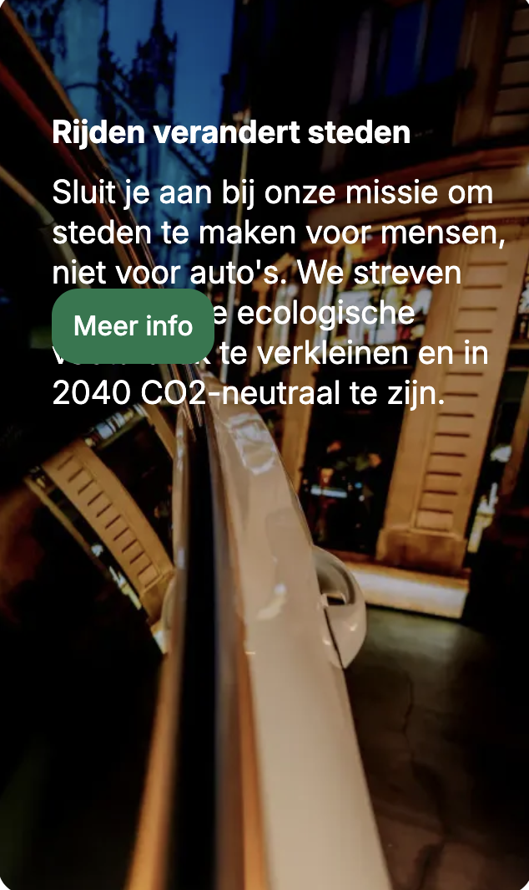
  Het lukt me echt niet om deze Anchor te verplaatsen naar beneden. Ik heb drie vergelijkbare slides en sommige van deze Anchors staan op verschillende plekken, maar ik heb met margins, padding, top en bottom,
  gap, text align, voor mijn idee alles geprobeerd, maar helaas is dit niet gelukt.

## Bronnenlijst

  
continu bijhouden terwijl je werkt

  Nb. Wees specifiek ('css-tricks' als bron is bijv. niet specifiek genoeg). 
  Nb. ChatGpT en andere AI horen er ook bij.
  Nb. Vermeld de bronnen ook in je code.

  1. Claude:slider/carousel, lettertype groottes
  2. Css-tricks:nth-type-child, classes
  3. student-assistent, hamburgermenu tips, timer
  4. google: aria-labels

